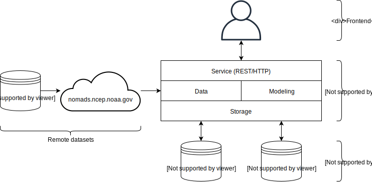

Overview: The *What* and *Why* of Apollo
==================================================

Apollo is an open source system for machine learning from numerical weather forecasts. Its purpose is to facilitate data collection, model training and evaluation, and the serving of predictions.

.. contents::
    :local:

Use Cases
--------------------------------------------------

Irradiance Forecasting
^^^^^^^^^^^^^^^^^^^^^^

.. todo::
    TODO

Model Evaluation
^^^^^^^^^^^^^^^^

.. todo::
    TODO

System Architecture
--------------------------------------------------

    System Architecture of Apollo

Data Ingestion Subsystem
^^^^^^^^^^^^^^^^^^^^^^^^

.. todo::
    TODO

Modeling Subsystem
^^^^^^^^^^^^^^^^^^

.. todo::
    TODO

Storage Subsystem
^^^^^^^^^^^^^^^^^

.. todo::
    TODO

Service Subsystem
^^^^^^^^^^^^^^^^^

.. todo::
    TODO
