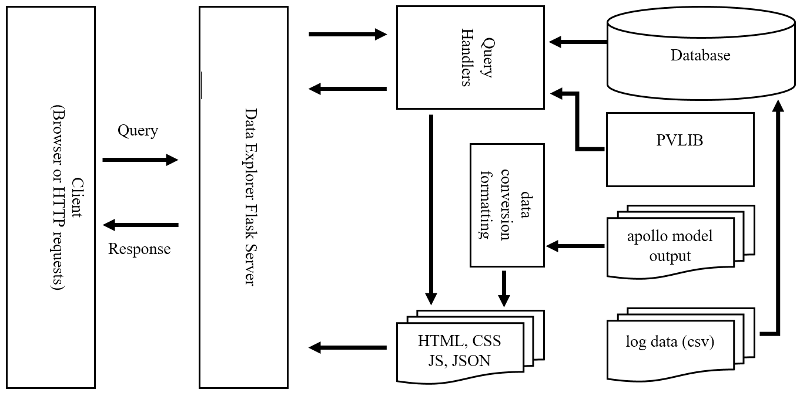
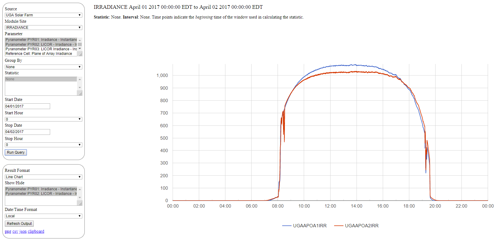
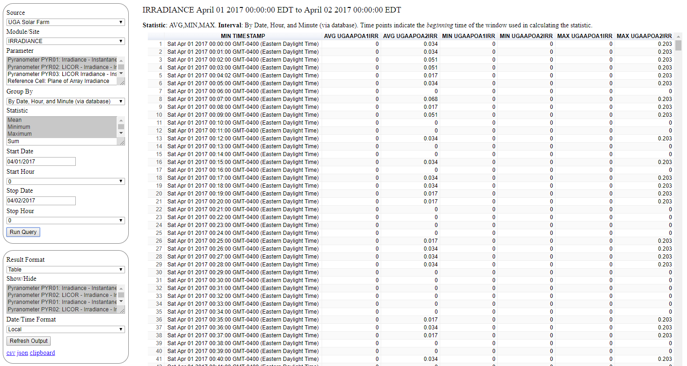
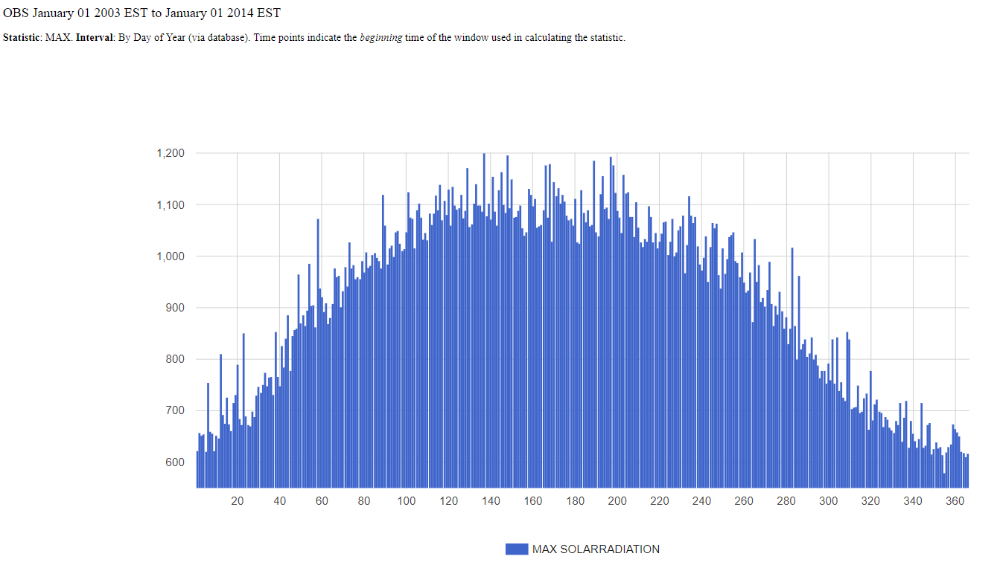
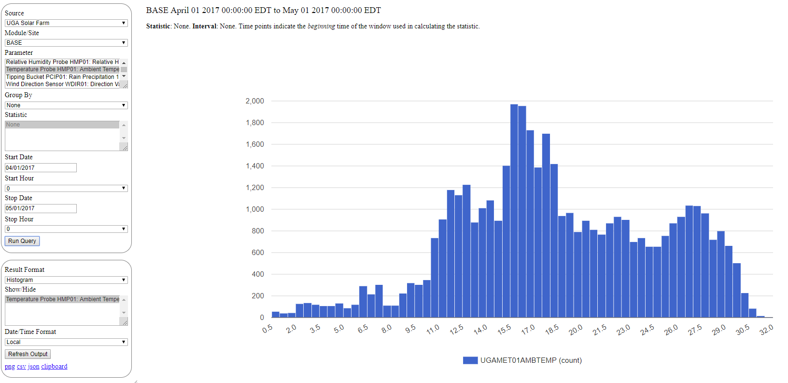

##################################################
Apollo Data Explorer
##################################################

.. contents::
    :local:


**************************************************
Overview
**************************************************

Apollo is primarily a software library for generating solar radiation forecasts
using trained machine learning models. The Apollo Data Explorer, however, is a
separate component designed to present both the 
forecasets and historical observations to users over a Web-based interface. 
It defines routines to convert forecast data to HTML pages. 
It also provides an interface to one or more relational databases storing 
historical weather and log data, and it defines a web server capable of serving 
static and dynamic content. 

This guide gives an overview of its functionality. 

**************************************************
System Architecture
**************************************************

The following are the primary components of the Data Explorer. 

1. A relational database storing data logged from the UGA Solar Farm, as well as a set
   of similar databases storing historical weather data logged from weather stations
   of the Georgia Environmental Monitoring Network (GAEMN). 
   
   Python scripts can be used to access and/or update the databases.
2. A :mod:`flask`-based web server that can serve static 
   files as well as handle requests to the databases and dynamically generate responses. 
3. Python scripts to convert JSON-encoded forecasts, generated by Apollo or PVLib-Python
   models, into HTML pages. Once generated, these can be served to end-users.
4. A set of static HTML, JavaScript, CSS, and JSON files defining the 
   client-side interface. 

The basic architecture is given in 



**************************************************
HTTP Server
**************************************************

A server, based on the Python microarchitecture :mod:`flask`, is used to handle client 
requests that involve querying a database or dynamically processing data. 
In a typical interaction, the server accepts requests formatted as 
attribute-value pairs and converts them into  SQL queries posed to the database. 
Once generated, the response to the client is returned as JSON data, which is 
then processed by client-side scripts for display to the user. 

The same server is responsible for processing requests involving 
PVLIB-PYTHON based forecasts. 

The server also can handle requests for static files. 
However, in a production environement, it would be better to set up another 
Web server such as Apache to handle requests to static files and configure a reverse
proxy to the Apollo Data Explorer.  If this is done
the primary Web server would redirect only selected queries to the Apollo Data Explorer.
Among other things, this would  allow the Apollo Data Explorer to run behind a firewall. 

The server can be started by by invoking :mod:`apollo.bin.data-explorer` with the appropriate arguments.::

    $ python -m apollo data-explorer --host 127.0.0.1 --port 5000
    INFO:  * host:127.0.0.1
    INFO:  * port:5000
    INFO:  * html:I:\html
    INFO:  * html url:/html
    INFO:  * dbdir:I:\db
    INFO:  * dbfile:default.db
    INFO:  * db url:/apollo
    INFO:  * Running on http://127.0.0.1:5000/ (Press CTRL+C to quit)

See the documentation on :mod:`apollo.bin.data-explorer` for more information.


**************************************************
System Database
**************************************************

SQLite  is used as the relational database storing solar farm and GAEMN data. 
A table (``BASE``, ``IRRADIANCE``, ``BASE``, ``A``-``E``) exists for each of the solar farm’s eight 
modules, and the table format closely follows the raw format of the solar farm log data files. 
Each observation (row of a data file) corresponds to a single record in a database table. 
The timestamp of each observation is used 
as the table’s primary key, but additional columns (``YEAR``, ``MONTH``, ``DAY``, etc.) also 
appear. Similarly, for each GAEMN site, a database is created containing a single table (```OBS``). 
This table holds all of the observations stored for that site. 

The tables are initially created in the database using static SQL scripts. 
Tables can be updated as new data arrives using a script invoked as an hourly 
(``cron``) job. The  script formats the data and then performs batch updates to the database. 

See :mod:`apollo.datasets.converters` for a detailed discussion of the database format
and data input. 


**************************************************
Forecast Models
**************************************************

Apollo defines multiple machine learning models that use historical weather 
observations and data from numerical weather predictions to forecast 
irradiance. Given that running the models is computationally somewhat intensive 
and based on data that is only periodically made available (e.g., the NAM 
forecasts used as input to Apollo  are generated only a few times a day), 
periodically generating static files  containing model output is the preferred 
way of providing data to users. 

Model output is stored as tabular data in a JSON file. One such sample forecast 
is given below. 

::

    {
        "source":"rf_test1",
        "name":"Random Forest Test Forecast",
        "description":"Predicted irradiance for UGABPOA1IRR for future hours 1 through 24. Prediction generated by a DecisionTree model.",
        "targets":"UGABPOA1IRR",
        "location":[33.9052058,-83.382608],
        "reftime":1510531200000,
        "site":"UGA-C-POA-1-IRR",
        "created":1550736650906,
        "start":1510142400000,
        "stop":1510228800000,
        "columns":[
                {"label":"TIMESTAMP","units":"","description":"","type":"datetime"},
                {"label":"UGA-C-POA-1-IRR","units":"w/m2","description":"","type":"number"}
                ],
        "rows":[
                ["2017-11-08 12:00:00",6.065183055555549],
                ["2017-11-08 13:00:00",31.46784888888889],
                ["2017-11-08 14:00:00",68.25919000000005],
                ["2017-11-08 15:00:00",90.45589760237971],
                ["2017-11-08 16:00:00",50.2633881944444],
                ["2017-11-08 17:00:00",22.679933869949444],
                ["2017-11-08 18:00:00",45.70434916666664],
                ["2017-11-08 19:00:00",34.95386999999995],
                ["2017-11-08 20:00:00",27.662586944444463],
                ["2017-11-08 21:00:00",11.051701111111129],
                ["2017-11-08 22:00:00",73.62441263888886],
                ["2017-11-08 23:00:00",5.668792307449482],
                ["2017-11-09 00:00:00",5.409829861111108],
                ["2017-11-09 01:00:00",4.422578055555556],
                ["2017-11-09 02:00:00",2.021209444444444],
                ["2017-11-09 03:00:00",1.4476183333333374],
                ["2017-11-09 04:00:00",0.0],
                ["2017-11-09 05:00:00",-0.0036365277777777776],
                ["2017-11-09 06:00:00",12.723052361111101],
                ["2017-11-09 07:00:00",4.422578055555556],
                ["2017-11-09 08:00:00",28.37874833333334],
                ["2017-11-09 09:00:00",4.993746944444455],
                ["2017-11-09 10:00:00",0.0],
                ["2017-11-09 11:00:00",0.03728083333333331],
                ["2017-11-09 12:00:00",0.41544999999999954]
                ]}


In addition to the numerical values comprising the forecast, the model  contains a summary 
providing a brief description of the model and its output. This format is described in more detail 
below and also in :mod:`apollo.server.handlers` and :mod:`apollo.bin.forecast-to-html`.
Hypothetically, any model conforming to the format could be incorporated into the system. 

When the HTML generation script is run, the model output directory is scanned, 
model JSON files are identified, and a set of HTML pages is created from these. 
The HTML files provide formatted representations of the forecasts and can 
sent by a Web server as static files. 

To incorporate a new model, a developer need only encode the model output 
appropriately in a JSON file and place it in the model directory to be scanned. 

See the documentation on :mod:`apollo.bin.forecast-to-html` for more information on the
format of model output and conversion to HTML. 

**************************************************
System User Interface 
**************************************************

The user interface consists of a set of Web pages with input elements used to 
query the server. The top level page is shown below. 


**Data Explorer** defines an interface for exploring historical GAEMN and 
Solar Farm observations. **Forecasts** provides links to the HTML pages generated from model.
As noted earlier, model output is generally generated at scheduled times, and 
links to the appropriate files are provided to the user.  
**PVLib** provides a simplified interface to the PVLib-Python library. 


As shown in the below figure, the interface for the Data Explorer consists of a 
navigation pane for input and a larger results pane to display graphs and 
tabular data. 

.. image:: data-explorer-results.png
    :target: data-explorer-results.png
 
To pose a query to the system, the user selects: 

1. A data source (Solar Farm or GAEMN site).
2. A module (table) from the source. 
3. A set of variables to view (such as temperature or solar radiation).
4. A time interval (start and end time-points).
5. A format for the results, e.g., *line chart*, *area chart*, 
   *bar chart*, *column chart*, *x-y scatter chart*, *histogram*, or *table*. 

Optionally, the user can select descriptive statistics (*minimum*, *maximum*, etc.) 
for variables as well as the duration over which the statistics are computed. 
E.g., the user can view the mean value for each day over a given month. 


**************************************************
Query Format
**************************************************

The output of a forecast model is generally stored as a set of static files. 
This is in contrast to the output for the Data Explorer and NAM Forecast 
modules, which is dynamically generated in response to user queries. 
The queries for the Data Explorer consist of a set of 
attribute-value (AV) pairs transported via an HTTP request (They comprise the 
query string of the URL in a GET request).  

Queries for the Data Explorer have the following format:

* ``source``: The data source to pull from, typically the name of a database.
* ``site``: The module or subset in the data source to use, typically a database table.
  E.g., ``site=IRRADIANCE`` refers to the irradiance module of the UGA solar farm. 
* ``start``: An integer timestamp indicating the starting point for which 
  data is desired. The number represents the number of milliseconds since 00:00:00 
  January 1, 1970 UTC. 
* ``stop``: A timestamp indicating the ending point for which data is desired.
* ``attribute``: An attribute for which data is desired. Typically, this 
  correspond to a column defined in a table. In the query, the attributes have the form 
  ``attribute=A1&attribute=A2...``
* ``statistic``: A statistic to compute for each attribute.
* ``groupby``: This string indicates how values should be grouped.
  
The following query string requests the minimum, maximum, and mean hourly values for the 
``UGAAPOA1IRR``, ``UGAAPOA2IRR``, and ``UGAAPOA3IRR`` attributes for December 31, 2016. 
The data source specified is the UGA solar farm. :: 

    source=solar_farm&site=IRRADIANCE&groupby=yearmonthdayhour&
    schema=solar_farm&start=1483160400000&stop=1483246800000&
    attribute=UGAAPOA1IRR&&attribute=UGAAPOA2IRR&&attribute=UGAAPOA3IRR&
    statistic=MIN&statistic=MAX&statistic=AVG
  

**************************************************
Output Format
**************************************************

Model output and results generated by querying the database are encoded as 
JSON objects. Though the format will vary depending upon which handler 
used to generated them, the results typically encode tabular data. Sample output is 
given below. The most important components are the column and row data. Both 
the label for each column and its datatype are specified.::

    {
    "site":"IRRADIANCE",
    "start":1483142400000,
    "stop":1483228800000,
    "subtitle":"MIN,AVG,MAX",
    "title":"TIMESTAMP,UGAAPOA1IRR",
    "columns":
    	[
    	{"description":"Unix integer timestamp","label":"MIN TIMESTAMP","type":"datetime","units":"s",},
    	{"description":"Pyranometer PYR01: Irradiance - Instantaneous - Plane of Array Value - from Logger","label":"AVG UGAAPOA1IRR","type":"number","units":"w/m2",},
    	{"description":"Pyranometer PYR01: Irradiance - Instantaneous - Plane of Array Value - from Logger","label":"MIN UGAAPOA1IRR","type":"number","units":"w/m2"},
    	{"description":"Pyranometer PYR01: Irradiance - Instantaneous - Plane of Array Value - from Logger","label":"MAX UGAAPOA1IRR","type":"number","units":"w/m2"}],
    "rows":
    	[
    	["2016-12-31T00:00:00.000Z",0,0,0],
    	["2016-12-31T01:00:00.000Z",0,0,0],
    	["2016-12-31T02:00:00.000Z",-0.009559201141226818,-6.701,0],
    	["2016-12-31T03:00:01.000Z",-0.008958923512747876,-6.325,0],
    	["2016-12-31T04:00:01.000Z",0,0,0],
    	["2016-12-31T05:00:00.000Z",0,0,0],
    	["2016-12-31T06:00:00.000Z",-0.009181021897810218,-6.289,0],
    	["2016-12-31T07:00:00.000Z",0,0,0],
    	["2016-12-31T08:00:00.000Z",0,0,0],
    	["2016-12-31T09:00:00.000Z",0,0,0],
    	["2016-12-31T10:00:00.000Z",0,0,0],
    	["2016-12-31T11:00:00.000Z",0,0,0],
    	["2016-12-31T12:00:00.000Z",1.1690508982035943,0,6.86],
    	["2016-12-31T13:00:33.000Z",28.726928895612698,7.236,77.162],
    	["2016-12-31T14:00:00.000Z",185.60058587479926,73.026,899.624],
    	["2016-12-31T15:00:00.000Z",205.0994150326798,130.884,678.346],
    	["2016-12-31T16:00:00.000Z",223.94614553990587,144.796,364.758],
    	["2016-12-31T17:00:00.000Z",89.98739137931047,56.435,151.188],
    	["2016-12-31T18:00:00.000Z",45.04593589743578,30.867,60.195],
    	["2016-12-31T19:00:23.000Z",37.365645933014335,21.09,52.675],
    	["2016-12-31T20:00:00.000Z",41.117300653594725,27.859,55.307],
    	["2016-12-31T21:00:00.000Z",25.12194594594577,13.194,39.139],
    	["2016-12-31T22:00:00.000Z",1.1687631160572336,0,12.818],
    	["2016-12-31T23:00:00.000Z",0,0,0],
    	["2017-01-01T00:00:00.000Z",0,0,0]],
    }    
 
**************************************************
Additional System Screen Shots 
**************************************************

Below is another typical screen of the Data Explorer. In this case, the user 
has chosen to display a single day's worth of pyranometer 
data from the *Irradiance* module of the UGA Solar Farm. Two pyranometers have 
been chosen in the navigation pane. No statistics have been chosen, and so the 
raw values are plotted. A line chart is the chosen output format. 


 
Other format types are possible. Below, the user has chosen to view the data 
(minimum, maximum and mean values for a pyranometer over a single day) as a 
table. Importantly, the raw data (in this case, recorded every 5 seconds) has 
been aggregrated into minute intervals and the mean value displayed. This 
prevents larger amounts of data from being transferred to the client. 
 


In the next image, a column chart has been chosen to display temperature. 
Also, the user has selected to display the maximum temperature for 24-hour 
periods over the course of a month. Other descriptive statistics, such as 
standard deviation, the 95th percentile, etc., are possible.
 
 .. image:: data-explorer-screenshot-4.png 
    :target: data-explorer-screenshot-4.png 
 

It is possible to group by time units such as months or days over multiple 
years. The below image shows the maximum solar radiation for each day of the 
year for the Griffin GAEMN weather station, observed over the period 2003-2014.
That is, for each of the possible 366 days of the year, the maximum value 
observed over the period 2003-2014 is reported. 



Lastly, the user has chosen below  to see a histogram of temperature over the course of a month. 



