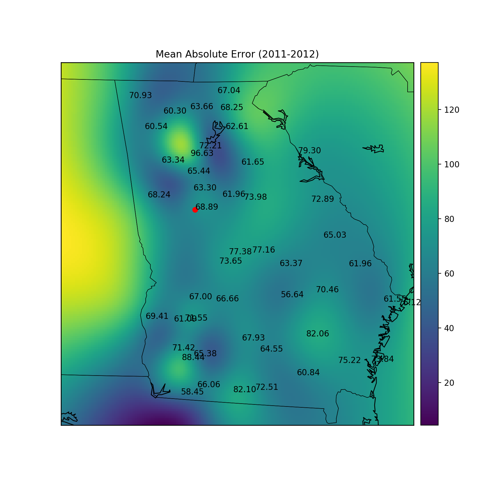
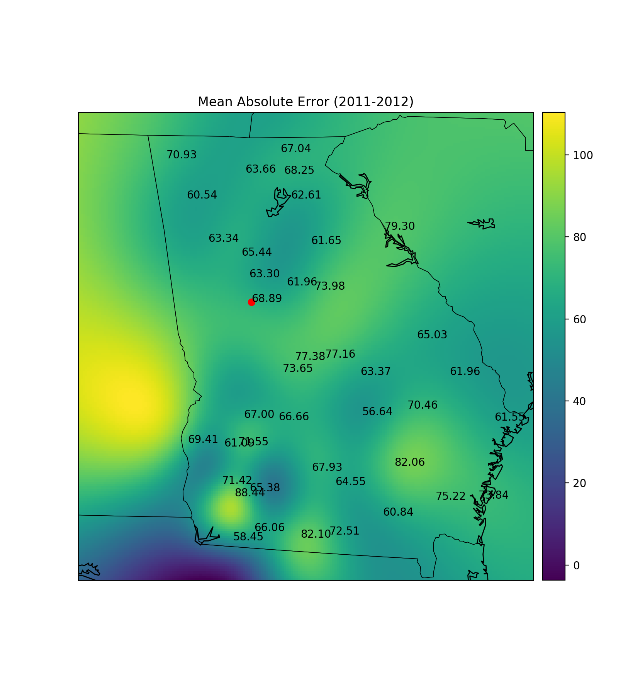

# Experiment 7

## Part 1

This experiment trains a random forrest regressor on the Griffin data from 2003-2010 with 24 hour lag. It then tests the model on the data of many cities from 2011-2012. The results are fed into a radial bias interpolation and plotted on a map.

The data seems to indicate that a random forrest model trained on Griffin data performs as well at predicting other cities' solar radiation as it does on its own. There are many cities in which predictions were more accurate than the predictions for Griffin!

The map also helps identify outliers. In particular, the Dunwoody predictions have a MAE of 96.63 W/m^2 while the surrounding stations are comparable to the Griffin predictions. Also, the Skidaway Island predictions have an error of 76.12 W/m^2 while the Savanah predictions have an error of only 61.55 W/m^2.

### Results:

## Part 2

I repeated the experiment without the cities `ALPHARET`, `CALHOUN`, `DEARING`, `DUNWOODY`, `SKIDAWAY`, and `WANSLEY`.

There is still a notable outlier in the south-west.

### Results:

